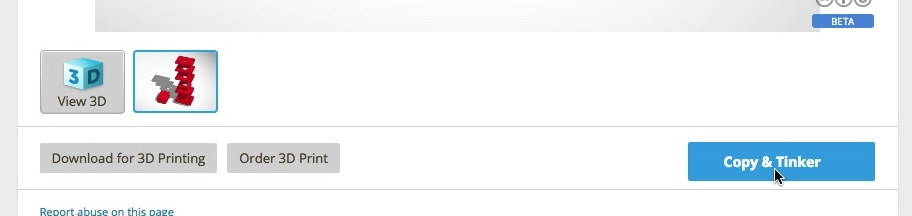
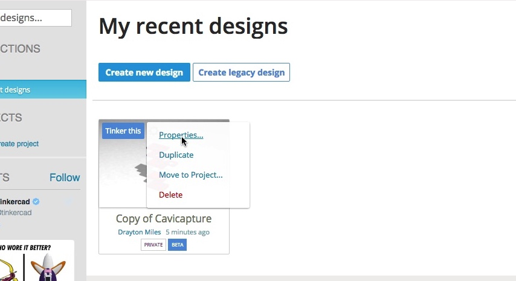

# Contributors Guide

OpenSourceOV is an Open Source project that encourages [open collaboration](https://en.wikipedia.org/wiki/Open-source_model) to improve the guides, instructions, 3D-printable models and resource lists found on the OpenSourceOV website. Submissions of alternative configurations, devices, or procedures are also encouraged. The vision of the project is an ecosystem of community-developed devices and software that utilise a range of optics, electronics, and image processing techniques to visualise the effect of water stress on plants.

The written resources - guides, instructions, resource lists etc - and 3D-printable files are hosted and managed through Github, a platform for contributors to collaborate on the development of Open Source content. See the [Github Guide](#github-guide) for more information about contributing to these resources.

The 3D CAD models are published via Tinkercad and Thingiverse. See the 3D [modelling guide](#3d-modelling-guide) for details.

## Github Guide

Github is a platform for contributors to collaborate on the development of Open Source content.

At the core of Github is the program Git, which was developed by the creator of the Linux operating system, Linus Torvalds, to manage the collaborative development of Linux. It has since been adopted as a standard for software development.

At its simplest level git is version control software that allows you to save versions of your content at different stages, typically whenever a task has been completed. With the versions saved you can compare or revert back to any of them at any time. At its most complex it allows multiple versions of the same content to be worked on concurrently, and by multiple people, and then later merged back together. 

Git is very powerful, but has a steep learning curve, and is not particulary user friendly. It is traditionally used by typing commands directly into the command line interface - the terminal on mac/linux, and command-prompt on windows. 

There are three ways you can submit changes and new files to the repositories:

1. Email them to christopher.lucani@utas.edu.au - by far the easiest option. More details below.
2. For simple changes to single files you can [use the Github interface](#quick-editing-a-single-file-on-github).
3. Use git [via the command line](#using-git-via-the-command-line)

### Emailing updates

You can email anything but if there are changes to specific files then download the relevant respository from Github (see Downloading Repositories for details), make the changes as required, then compress the folder using zip or rar (or whatever), and email the compressed archive to christopher.lucani@utas.edu.au with some details about what you're submitting. 

### Quick editing a *single* file on Github

These instructions describe the procedure for adding a new supplier to the suppliers list using the Github interface.

1. [Create a Github account](https://github.com/join) if you don't already have one and log in.

2. Navigate to the relevant repository by following links from the [OpenSourceOV.org website ](http://www.opensourceov.org) or organisation page on Github: [https://github.com/OpenSourceOV](https://github.com/OpenSourceOV).

3. Click to navigate to the relevant file in the repository. 

    

4. Click the pencil icon at the top right of the editing section to edit the file.

    

4. Make changes to the file using the Github editor

    

    The syntax Github uses for text files is called Markdown. More information about Markdown can be found on [Github's Markdown Guide](https://guides.github.com/features/mastering-markdown/). 'Preview changes' at the top of the file is useful for checking the markdown syntax is correct.

    When you first edit a file from a repository you'll see this message at the top of the editor:

    > You're editing a file in a project you don't have write access to. We've created a fork of this project for you to commit...

    So what does this mean?

    The way OpenSource software works is that a single master repository is managed by a few (or indeed many!) core members. Core members can make direct changes to the repository, but anyone else has to make their changes first on a personal copy and then request to have those changes integrated back into the master repository.

    The process of creating a personal copy of the repository is called *forking* and *pull requests* are the way users can request to have changes integrated into the master repository.

    When you make edits to a repository via the Github interface it does a lot of the work for you. What this message is saying is that it sees you don't already have a copy of the repository and so it has forked one for you and is providing the file from the forked repository for you to edit.

    The message won't appear again because Github will see that you already have the repository forked and it will take you to edit that version again.

    So what about 'Submitting a change ot this file will write it to a new branch in your fork'?

    Remember git is powerful version control software that not only allows you to keep track of versions of your content over time but also allows you to concurrently work on different versions. These versions are called *branches*. So really what's happening is Github has created a personal copy (forked) and created a new version of that copy that will contain the changes you are about to make. Later when you request to submit the changes you'll actually be submitting the branch for integration.

6. Once you've made the changes scroll down to the bottom of the page and provide a description and comments about the change. Depending on the change this can be as simple or as complex as required. Some changes may need substantial justification while others, like adding a supplier, only require a brief comment.

    

7. Click 'Propose file changes' to save the change. Note you are not submitting the pull request yet.

    

8. Create the pull request to submit the changes for integration in the master repository.

    With the file changes saved you'll get a screen which provides a summary of the changes and allows you to initiate the pull request by clicking the 'Create pull request' button. Note it's still not submitted yet!

    

    The next screen will ask you for more comments and on this screen you click the final 'Create pull request'.

    

9. Done!

### Using git via the command line

There are a number of online guides for using git and submitting changes to content hosted on Github, here are a few:

* [https://guides.github.com/](https://guides.github.com/) - Github's Guides
* [https://help.github.com/articles/fork-a-repo/](https://help.github.com/articles/fork-a-repo/) - Github's guide for submitting changes to a repository
* [https://git-scm.com/](https://git-scm.com/) - from the creators of Git
* [https://www.sitepoint.com/git-for-beginners/](https://www.sitepoint.com/git-for-beginners/)

### Downloading repositories

Any of the repositories can be downloaded directly from Github.

1. Navigate to the relevant repository by following links from the [OpenSourceOV.org website ](http://www.opensourceov.org) or organisation page on Github: [https://github.com/OpenSourceOV](https://github.com/OpenSourceOV).

2. From the repository homepage click the 'Clone or download' button at the top right then 'Download ZIP'

    
    

## 3D Modelling Guide

All current 3D models were designed on [Tinkercad](http://www.tinkercad.com) - an excellent online 3D modelling program for creating 3D-printable models. The Tinkercad interface is quick and easy to use, free, and exports the necessary files for a 3D printer or to send to a 3D printing service.

The following guide takes you through the steps to make an adjustment to the clamp and make the model available for others to use. 

1. Create a free account on [Tinkercad](http://www.tinkercad.com) and sign in.

2. Work through the Tinkercad tutorials at [https://www.tinkercad.com/learn/](https://www.tinkercad.com/learn/).

3. In the browser go to [https://www.tinkercad.com/things/7c08LzE3G9j](https://www.tinkercad.com/things/7c08LzE3G9j). This is a public listing of the clamp 3D model.

3. Make sure you are logged in to Tinkercad. Click the 'Copy & Tinker' button to copy the model to your Tinkercad account.
    
    

4. Each of the components in the clamp are composed of smaller components grouped together, so the first step in making changes is to familiarise yourself with how the component is formed. Choose one of the models and move it outside the stack so it's easier to work with then click the Ungroup button.
    
    

5. Let's say we just wanted to make the height of the component thinner. Click the body of the component and some size and shape modifiers (little squares) will appear. 

    

6. The modifier at the center of the model will adjust the height. Click the little square and a height input box will appear. 
    
    

7. Click into the heigh input box and enter a new value to adjust the height. Press enter to save the value.
    
    

8. With the adjustment done select all the components in the model using the mouse and click the group button.

    

9. To export the part for printing, click the component to select it then click the 'Export' button at the top right.

    

10. Choose 'The selected shape' and click the '.STL' button to download as an .stl file.
    
    

11. Done! Send the file for 3D printing!

If you want to share the modification, or indeed an entirely new model, then follow the steps below

1. Go to your Tinkercad homepage (just go to [http://www.tinkercad.com](http://www.tinkercad.com) while logged in) - you should be able to see your new tinkercad model.
  
    

2. Click the gear icon and click 'Properties'

    

3. In the properties window change the Visibility to 'Public' and click 'Save changes' (this will close the window)

    

4. Click the model image to open up information about the model and copy the Link URL from the bottom of the window.

    

5. Send the URL and description of the model/modification to updates@opensourceov.org or submit a pull request to the repository.

  

